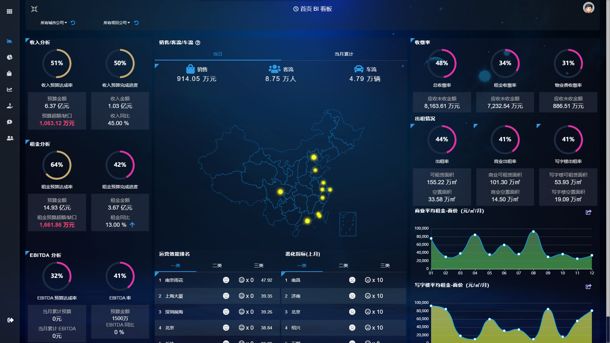

# 从数据中获益

## 系统建设的需求

依据业务扩张及商业智能化需求并借鉴商业地产行业领先实践，建设一个适用于**资产管理的数字化运营信息平台**，主要包括数据仓库建设、前台报表展现、移动端展现、数据挖掘应用、商业管理支撑等功能。 

同时必须确保数据仓库的**规范化**、**结构化**、**准确性**、**及时性**、**稳定性**、**易用性**、**容错性**、且**可扩展性**；实现基础的商业管理报表编制，满足日常集团旗下各项目运营需求的前台多维报表分析、完善用户自助查询及数据挖掘应用， 可为**公司财务**、**业务分析**提供帮助。

### 提高效率，减轻工作量

> 优化人工处理统计数据的工作模式，采用系统对接获取数据， 提高报告编制效率与准确性

### 辅助商业决策

> 构建不同的项目、业态的管理报表体系
>
> 构建财务报表体系、对预算指标进行追踪、 为管理层提供决策支持

### 方便快捷

> 借助移动互联网平台优势，便于管理层随时随地随意查看数据报表

### 数据沉淀

> 通过录入和系统对接，收集业务数据，形成大数据库，实现数据的收集和沉淀

## 系统建设总目标

<table>
  <thead>
    <tr>
      <th style="text-align:left">&#x5FEB;&#x901F;&#x89C1;&#x6548;</th>
      <th style="text-align:left">&#x6570;&#x636E;&#x81EA;&#x52A8;&#x5316;</th>
      <th style="text-align:left">&#x51B3;&#x7B56;&#x6A21;&#x62DF;</th>
    </tr>
  </thead>
  <tbody>
    <tr>
      <td style="text-align:left">1.&#x5B9E;&#x73B0;&#x7ECF;&#x8425;&#x6570;&#x636E;&#x7684;&#x5E73;&#x53F0;&#x5316;</td>
      <td
      style="text-align:left">1.&#x4E0E;&#x8DDF;&#x591A;&#x4E1A;&#x52A1;&#x7CFB;&#x7EDF;&#x96C6;&#x6210;</td>
        <td
        style="text-align:left">&#x5728;&#x5E73;&#x53F0;&#x4E0A;&#x5EFA;&#x7ACB;&#x9884;&#x6D4B;&#x6A21;&#x578B;&#xFF0C;&#x652F;&#x6301;&#x51B3;&#x7B56;&#x6A21;&#x62DF;</td>
    </tr>
    <tr>
      <td style="text-align:left">
        
2.&#x4E1A;&#x52A1;&#x7CFB;&#x7EDF;&#x6709;&#x7684;&#x6570;&#x636E;&#x7EDF;&#x4E00;&#x62BD;&#x53D6;

        
&#x5230;&#x6570;&#x636E;&#x4ED3;&#x5E93;&#x7BA1;&#x7406;

      </td>
      <td style="text-align:left">2.&#x5B9E;&#x73B0;&#x7ECF;&#x8425;&#x6570;&#x636E;&#x8FFD;&#x6EAF;&#x5230;&#x4E1A;&#x52A1;&#x6E90;&#x5934;</td>
      <td
      style="text-align:left"></td>
    </tr>
    <tr>
      <td style="text-align:left">3.&#x76EE;&#x524D;&#x4E1A;&#x52A1;&#x7CFB;&#x7EDF;&#x6CA1;&#x6709;&#x7684;&#x6570;&#x636E;&#x5E73;&#x53F0;&#x4E0A;&#x8865;&#x5F55;</td>
      <td
      style="text-align:left">3.&#x5B9E;&#x73B0;&#x5927;&#x6570;&#x636E;&#x63A5;&#x5165;,&#x5206;&#x6790;&#x667A;&#x80FD;&#x5316;</td>
        <td
        style="text-align:left"></td>
    </tr>
  </tbody>
</table>

### 针对高层 （有用）

#### 一. 掌控局面

> 1.信息准确、及时、全面 
>
> 2.目标与执行差异及时可见 
>
> 3.内部信息与外部信息相互印证

#### 二.把握未来

> 1.长期预测定大势 
>
> 2.滚动预测看执行

#### 三.复杂决策

> 1.情景模拟助判断，需要考虑行业趋势、业务组合、租价、续租、回款等众 多影响决策判断的关键因素
>
> 2.针对公司运营，以出租单元为基础，以出租率为变量，考虑整体运营情况

### 针对中层（管用）

#### 一. 决策支持

> 1. 提供有用的信息
>
> 2.信息内容得到很好的组织
>
> 3.对领导需求的及时响应

#### 二.体系构建

> 1.更多业务部门的参与 
>
> 2.更加体现业务逻辑 
>
> 3.抓住主要矛盾

#### 三.执行反馈

> 1.实时监控本部门执行情况 
>
> 2.滚动调整，明确改进措施

### 针对基层 （易用）

#### 一.提升工作效率

> 数据一次性录入，多次使用，更多数据直接采集

#### 二.提升工作价值

> 由事务型工作转到分析型工作

<table>
  <thead>
    <tr>
      <th style="text-align:center"></th>
      <th style="text-align:center"></th>
    </tr>
  </thead>
  <tbody>
    <tr>
      <td style="text-align:center">
        
      </td>
      <td style="text-align:center">
        

        

          
        

      </td>
    </tr>
    <tr>
      <td style="text-align:center">&#x8FD0;&#x8425;&#x6307;&#x6807;&#x5168;&#x8986;&#x76D6;&#xFF0C;&#x5305;&#x542B;&#x4F01;&#x4E1A;&#x53CA;&#x9879;&#x76EE;&#x7ECF;&#x8425;&#x7684;&#x5168;&#x90E8;&#x6307;&#x6807;</td>
      <td
      style="text-align:center">&#x9884;&#x5148;&#x8BBE;&#x7ACB;&#x8BA1;&#x7B97;&#x89C4;&#x5219;&#xFF0C;
        &#x5FEB;&#x901F;&#x3001;&#x51C6;&#x786E;&#x5730;&#x63D0;&#x4F9B;&#x6240;
        &#x9700;&#x6570;&#x636E;</td>
    </tr>
    <tr>
      <td style="text-align:center">
        

          
        

        

      </td>
      <td style="text-align:center">
        

        

          
        

      </td>
    </tr>
    <tr>
      <td style="text-align:center">&#x8D23;&#x4EFB;&#x5230;&#x4EBA;&#xFF0C;&#x786E;&#x4FDD;&#x6570;&#x636E;&#x51C6;&#x786E;&#x3001;&#x53CA;&#x65F6;</td>
      <td
      style="text-align:center">&#x6307;&#x6807;&#x53EF;&#x66FF;&#x6362;&#xFF0C;&#x6EE1;&#x8DB3;&#x51B3;&#x7B56;&#x5C42;&#x5173;&#x6CE8;&#x6307;&#x6807;&#x591A;&#x53D8;&#x7684;&#x9700;&#x6C42;</td>
    </tr>
  </tbody>
</table>

